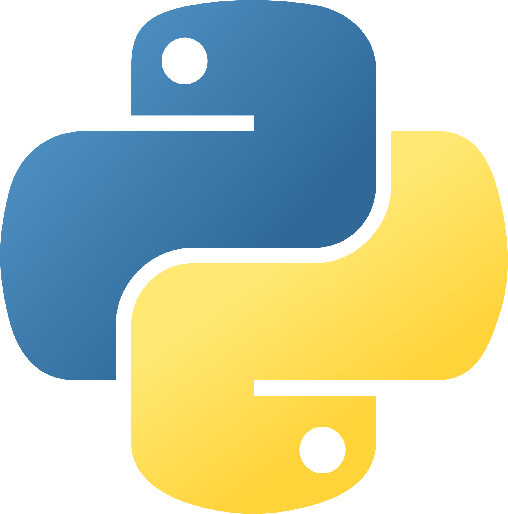

### Hi there, I'm Daniel👋

- 🔭 I’m currently working on some LeetCode problems
- 🌱 I’m currently learning Processing, LLM-oriented Python Packages and NeoVim 
- 💻 My main languages are Phyton </img> and R </img>

- 💬 Ask me about LOOM
- 📫 How to reach me: [Linkedin](https://www.linkedin.com/in/daniel-gahler-501992172/)
- 😄 Pronouns: He/Him
- 🤖 A repo I'm proud of: [DiscordBlogBot](https://www.linkedin.com/in/daniel-gahler-501992172/)
- 🐉 An abandoned repo that I should put in better shape: [Window-Randomizer](https://github.com/darkshoxx/Alt-Tab-Randomizer)
- 🪭 A dev I'm a fan of: [Anthony Sottile ](https://github.com/asottile)

