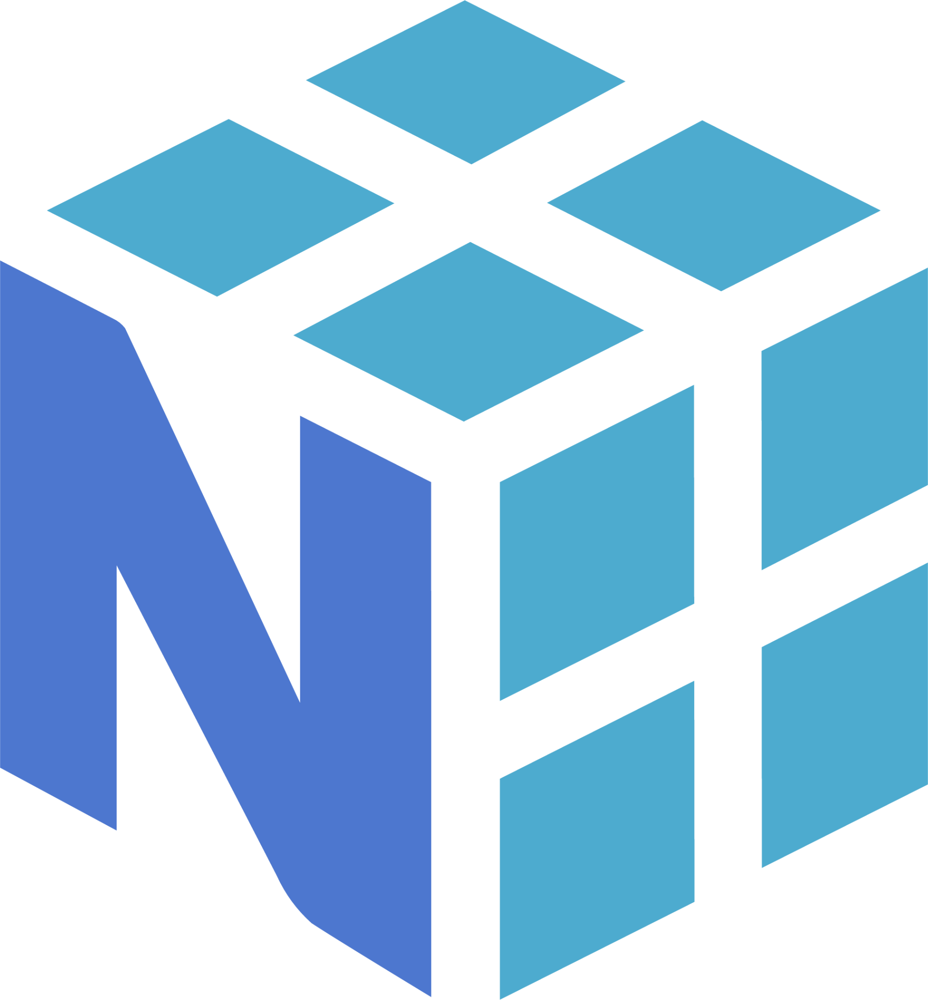
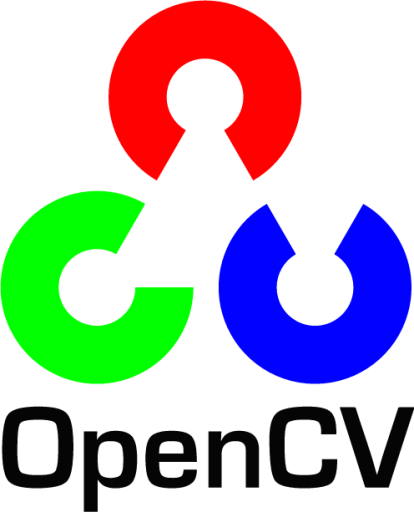
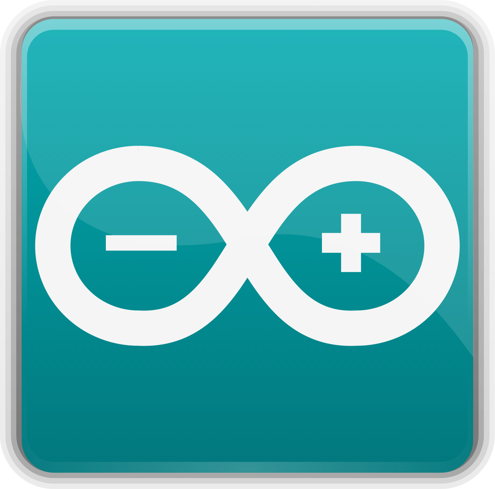

# Daniel Gahler

I'm a Software Developer with a PhD in Marketing (Focus Statistics and Data Analysis) and a Masters in Mathematics (Focus on Abstract Algebra) and a passion for automation.

## Skills & Expertise

### Languages:
<ul>
    </img>  </img>  </img>  
  <li> ★★★★★ Python  

    
<i>Python-specific Frameworks and Libraries</i>

    <ul>
    </img> 
    </img>
    </img>
    </img>
    </img>
    </img>
    </img>
    </img>
    <li> NetworkX 
    <li> Windows API
    <li> tkinter 
    <li> Matplotlib 
    <li> Pandas 
    <li> Numpy 
    <li> Pillow 
    <li> CV2 
    <li> Asyncio, threading
    </ul>
    

  <li> ★★★★☆ R 
  <li> ★★★★☆ LaTeX 
</ul>
  

    
<i>Webstack</i>

    <ul>
    </img> 
    </img>
    </img>
    </img>
    </img>
    </img>
    <li> ★★★★☆ HTML
    <li> ★★★☆☆ CSS
    <li> ★★☆☆☆ JS / ECMAS
    <li> ★☆☆☆☆ React
    <li> ★★☆☆☆ npm / node.js
    </ul>
    

  

    
<i>Other Langauges I've used</i>

    <ul>
    </img> 
    </img>
    </img>
    </img>
    </img>
    </img> 
    </img> 
    </img> 
    </img> 
    </img> 
    <li> ★★★☆☆ Unix- and Microsoft-based shells
    <li> ★★☆☆☆ Arduino
    <li> ★★☆☆☆ Assembly, <a href="https://eater.net">Ben Eater Design</a>
    <li> ★★☆☆☆ Java / Processing
    <li> ★☆☆☆☆ C / C++  
    <li> ★☆☆☆☆ SQL / Databases
    <li> ★☆☆☆☆ Fortran
    <li> ★☆☆☆☆ PHP
    </ul>
   

     

    
<i>Frameworks / Libraries:</i>

 
  <ul>
    </img> 
    </img>
    </img>
    </img>
    </img>
    </img> 
    </img> 

  <li> GitLab Pipelines / Github Actions
  <li> pre-commit, tox
  <li> docker including dind and docker-compose
  <li> AWS
  </ul>
     

## Current Focus

* Honing my problem-solving skills with LeetCode
* Learning Processing, LLM libraries, NeoVim

## Projects

### Featured Projects

* [DiscordBlogBot](https://github.com/darkshoxx/DiscordBlogBot): A Discord bot that posts a notification when a blogger from a predefined list pulishes a new post 
* [Cryptic Crossword Scraper](https://github.com/darkshoxx/crosswords): Initially creates a list of Times Cryptic Crosswords, and generates the layout, clues, solutions and solving video with explanations to a selected entry on the list.

### Other Projects

* [WindowSelector](https://github.com/darkshoxx/WindowSelector): Allows you to swap between specific active windows with keybinds. Similar to Windows' Alt-Tab feature, but better.
* [Window Randomizer](https://github.com/darkshoxx/Alt-Tab-Randomizer): Forces you to swap between windows after a random number of seconds or clicks. Similar to Windows' Alt-Tab feature, but a deliberate restriction, built for a very specific situation.

## Connect

* Reach me on LinkedIn: [LinkedIn](https://www.linkedin.com/in/your-linkedin-profile/)
* Reach me on Twitter: [Twitter](https://twitter.com/darkshoxx)
* Reach me by Email: username at </img> dot de

## Extras

* Inspirations: [Anthony Sottile](https://github.com/asottile) (Author of pre-commit and tox)
* Fun Fact: My username's origin is the guy who sold me my first console + a name from an over-the-top [instructional video](https://www.youtube.com/watch?v=9X39SWIaIN4&t=12s).

## Stats

